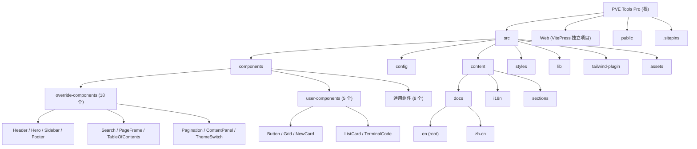

# PVE Tools Pro - Astro Starlight Documentation Site

## 项目愿景

PVE Tools Pro 是一个基于 **Astro Starlight** 框架构建的现代化文档站点，为 PVE Tools (Proxmox Virtual Environment 工具集) 提供官方文档。它提供了丰富的自定义组件、增强的 UI 体验和多语言支持（英文/简体中文），旨在帮助用户快速了解和使用 PVE Tools。

本项目使用 Cloudflare Workers 部署（静态资产模式），同时支持 Netlify 部署。

## 架构总览

```
技术栈：
- 框架: Astro 6.0.4 + Starlight 0.38.1
- 样式: Tailwind CSS 4.x + 自定义 CSS（分层系统）
- 构建: Vite 7.x
- 部署: Cloudflare Workers（主要） / Netlify
- 语言: TypeScript / Astro 组件
- 包管理: npm / yarn / bun
- 字体: MiSans Latin
- 主色调: #4F46E5 (Indigo)
```

## 模块结构图



## 模块索引

| 模块路径 | 职责 | 入口文件 | 语言 |
|:---|:---|:---|:---|
| `src/components/` | UI 组件（Starlight 覆盖组件 + 自定义用户组件 + 通用组件） | 多个 `.astro` 文件 | Astro |
| `src/components/override-components/` | Starlight 内置组件的自定义覆盖（18 个） | Header / Hero / Sidebar / Footer 等 | Astro |
| `src/components/user-components/` | 用户可复用的自定义文档组件（5 个） | Button / Grid / NewCard / ListCard / TerminalCode | Astro |
| `src/config/` | 站点配置（主题、导航、国际化、社交链接等） | config.json | JSON |
| `src/content/` | 文档内容、i18n 翻译、页面区块 | content.config.ts | MD/MDX/JSON |
| `src/content/docs/` | 英文（根）和中文文档内容 | index.mdx | MD/MDX |
| `src/content/docs/zh-cn/` | 简体中文文档（含高级教程子目录） | guide.md, features.md, advanced/ 等 | MD |
| `src/content/i18n/` | UI 翻译字符串 | en.json, zh-cn.json | JSON |
| `src/content/sections/` | 首页可复用区块（如 CTA） | call-to-action.md | MD |
| `src/styles/` | 全局样式和组件样式（CSS 分层系统） | global.css | CSS |
| `src/lib/` | 工具函数（语言解析、文本转换） | languagePerser.ts, textConverter.ts | TypeScript |
| `src/tailwind-plugin/` | 自定义 Tailwind CSS 插件（主题变量、网格系统） | tw-theme.js, tw-bs-grid.js | JavaScript |
| `src/assets/` | 图片和媒体资源（SVG/PNG/PDF） | pve-logo.svg, pve-logo-dark.svg | 静态资源 |
| `public/` | 静态公共资源（favicon、Logo、manifest） | favicon.svg, sitepins-manifest.json | 静态资源 |
| `.sitepins/` | Sitepins 部署配置 | config.json | JSON |
| `Web/` | 独立的 VitePress 文档站（旧版/补充站点） | index.md, .vitepress/config.mts | Vue/MD |

## 运行与开发

### 常用命令

| 命令 | 说明 |
|:---|:---|
| `npm install` | 安装依赖 |
| `npm run dev` | 启动本地开发服务器 (localhost:4321) |
| `npm run build` | 构建生产版本到 `dist/` |
| `npm run preview` | 预览构建结果 |
| `npm run check` | 运行 Astro 类型检查 |
| `npm run deploy:cf-workers` | 构建并部署到 Cloudflare Workers |
| `npm run preview:cf-workers` | 构建并本地预览 Cloudflare Workers 版本 |

### 环境要求

- Node.js 20+（Netlify 配置指定）
- 包管理器: npm / yarn / bun

### 开发服务器

```bash
npm run dev
# 访问 http://localhost:4321
```

### 部署

**Cloudflare Workers（主要）：**
```bash
npm run deploy:cf-workers
```
配置文件: `wrangler.jsonc`，部署名为 `dockit-astro`，使用 Static Assets 模式。

**Netlify：**
```bash
npm run build
# 自动部署（netlify.toml 已配置，Node 20）
```

## 测试策略

当前项目**没有**自动化测试套件。测试策略建议：

- 使用 `npm run check`（astro check）进行类型检查
- 手动验证页面渲染和组件功能
- 构建后在本地预览验证
- 注意: 无 ESLint/Prettier 配置

## 编码规范

### 文件组织

- 组件使用 `.astro` 单文件组件格式
- Starlight 覆盖组件放在 `src/components/override-components/`
- 用户自定义组件放在 `src/components/user-components/`
- 通用组件（手风琴、面包屑等）放在 `src/components/` 根目录
- 配置文件统一放在 `src/config/` 目录

### 样式约定

- 使用 Tailwind CSS 4.x 工具类
- CSS 分层顺序: `base, starlight, theme, components, utilities`
- 自定义样式使用 `@layer starlight.core` 或 `@layer starlight.components` 分层
- 主题变量通过 `src/tailwind-plugin/tw-theme.js` 从 `theme.json` 动态生成
- 支持深色/浅色模式切换（通过 `data-theme` 属性）
- 渐变色变量: `--color-primary-gradient`

### 路径别名

```typescript
// tsconfig.json 和 astro.config.mjs 中配置
"@/*" -> "src/*"
```

### 组件覆盖模式

Starlight 组件通过 `astro.config.mjs` 的 `components` 配置覆盖：
- Head, Header, Hero, PageFrame, PageSidebar
- TwoColumnContent, ContentPanel, Pagination, Sidebar

### 侧边栏图标语法

侧边栏标签支持 `[icon-name]` 语法在标签文本前嵌入图标：
- `[seti:vite]`, `[seti:typescript]` - Seti UI 图标
- `[document]`, `[setting]`, `[pencil]` - Starlight 内置图标

### 多语言支持

- 默认语言: English (en)，文档路径无前缀
- 支持语言: English (en), 简体中文 (zh-cn)
- 英文文档: `src/content/docs/`（根路径，无需 `/en/` 前缀）
- 中文文档: `src/content/docs/zh-cn/`
- UI 翻译: `src/content/i18n/en.json`, `src/content/i18n/zh-cn.json`
- 菜单翻译: `src/config/menu.en.json`, `src/config/menu.zh-cn.json`
- locale 配置: `src/config/locals.json`

### 配置文件说明

| 文件 | 用途 |
|:---|:---|
| `src/config/config.json` | 站点核心配置（标题、Logo、搜索开关、导航按钮等） |
| `src/config/theme.json` | 主题颜色和字体配置（深色/浅色模式） |
| `src/config/sidebar.json` | 侧边栏导航结构（支持 autogenerate） |
| `src/config/locals.json` | 国际化 locale 定义 |
| `src/config/social.json` | 社交媒体链接（目前仅有 GitHub） |
| `src/config/menu.en.json` | 英文菜单和页脚配置 |
| `src/config/menu.zh-cn.json` | 中文菜单和页脚配置 |

## AI 使用指引

### 项目结构理解

1. 这是一个 Astro + Starlight 文档站点，不是通用 Web 应用
2. 核心逻辑在 `astro.config.mjs` 中配置 Starlight 集成
3. 组件覆盖是主要的定制方式，所有覆盖组件在 `src/components/override-components/`
4. 内容通过 MD/MDX 文件编写，支持导入 Astro 组件
5. `Web/` 目录是一个独立的 VitePress 项目，与根目录 Astro 项目无关

### 常见任务

- **添加新文档页面**: 在 `src/content/docs/`（英文）或 `src/content/docs/zh-cn/`（中文）下创建 `.md` 或 `.mdx` 文件
- **修改主题颜色**: 编辑 `src/config/theme.json`
- **修改导航**: 编辑 `src/config/sidebar.json`（侧边栏）或 `src/config/menu.*.json`（顶部导航）
- **添加自定义组件**: 在 `src/components/user-components/` 创建 `.astro` 文件
- **修改全局样式**: 编辑 `src/styles/` 下的 CSS 文件
- **添加新语言**: 1) `locals.json` 添加 locale; 2) 创建 `menu.{lang}.json`; 3) `src/content/i18n/{lang}.json`; 4) `src/content/docs/{lang}/` 添加文档

### 前端变更验证流程（必须遵守）

每次对前端相关文件（组件 `.astro`、样式 `.css`、配置 `config.json`/`theme.json`/`sidebar.json` 等）进行改动后，**必须执行以下验证流程**：

1. 确保开发服务器正在运行（`npm run dev`，端口 `localhost:4321`）
2. 使用 **Playwright MCP 工具**访问受影响的页面，截图或检查 DOM 结构
3. 验证改动是否按预期生效，布局、样式、交互是否正常
4. 如发现问题，立即修复并重复验证，直到结果正确

**默认行为**：每次前端改动后都必须进行 Playwright 二次验证，无需用户提醒。
**豁免条件**：仅当用户主动表示"可以不用 re-check"或"跳过验证"时，才可跳过此流程。

### 注意事项

- 修改 Starlight 覆盖组件时需保持与原组件相同的 props 接口
- 侧边栏图标语法 `[icon-name]` 需通过 `textConverter.ts` 的工具函数解析
- `languagePerser.ts` 文件名有拼写错误（应为 `languageParser`），但这是项目现状
- Tailwind 插件 `tw-theme.js` 从 `theme.json` 动态生成 CSS 变量，修改主题需通过此配置
- 站点标题为 "PVE Tools Pro"，品牌色为 `#4F46E5`
- 中文菜单文件为 `menu.zh-cn.json`（不是 `menu.fr.json`）

## 变更记录 (Changelog)

- **2026-06-02**: 全面更新 CLAUDE.md 文档，修正语言支持信息（en + zh-cn），补充 Web 模块引用，完善配置文件说明，更新 Mermaid 结构图
